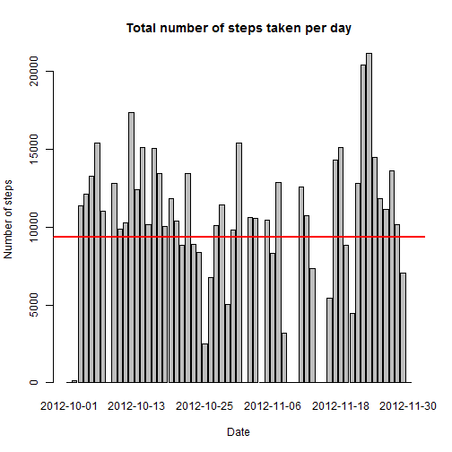

# Project1

Package used:

```r
library(dplyr)
```

## Loading the data


```r
data <- read.csv("./activity.csv", header = TRUE)
head(data)
```

```
##   steps       date interval
## 1    NA 2012-10-01        0
## 2    NA 2012-10-01        5
## 3    NA 2012-10-01       10
## 4    NA 2012-10-01       15
## 5    NA 2012-10-01       20
## 6    NA 2012-10-01       25
```


```r
str(data)
```

```
## 'data.frame':	17568 obs. of  3 variables:
##  $ steps   : int  NA NA NA NA NA NA NA NA NA NA ...
##  $ date    : Factor w/ 61 levels "2012-10-01","2012-10-02",..: 1 1 1 1 1 1 1 1 1 1 ...
##  $ interval: int  0 5 10 15 20 25 30 35 40 45 ...
```


```r
summary(data)
```

```
##      steps                date          interval     
##  Min.   :  0.00   2012-10-01:  288   Min.   :   0.0  
##  1st Qu.:  0.00   2012-10-02:  288   1st Qu.: 588.8  
##  Median :  0.00   2012-10-03:  288   Median :1177.5  
##  Mean   : 37.38   2012-10-04:  288   Mean   :1177.5  
##  3rd Qu.: 12.00   2012-10-05:  288   3rd Qu.:1766.2  
##  Max.   :806.00   2012-10-06:  288   Max.   :2355.0  
##  NA's   :2304     (Other)   :15840
```

-------------------
## What is mean total number of steps taken per day?

  Calculating and reporting the total number of steps taken per day. The red line on the plot is the mean of steps taken per day.


```r
perday <- group_by(data, date)
stepsperday <- summarise(perday, steps = sum(steps, na.rm =TRUE))
head(stepsperday)
```

```
## Source: local data frame [6 x 2]
## 
##         date steps
##       (fctr) (int)
## 1 2012-10-01     0
## 2 2012-10-02   126
## 3 2012-10-03 11352
## 4 2012-10-04 12116
## 5 2012-10-05 13294
## 6 2012-10-06 15420
```

```r
barplot(stepsperday$steps, names = stepsperday$date, xlab = "Date", ylab ="Number of steps", main ="Total number of steps taken per day")
abline(h=mean(stepsperday$steps), col="red", lwd=2)
```



  Calculating and reporting the mean of the total number of steps taken per day

```r
meanstepsperday <- mean(stepsperday$steps)
meanstepsperday
```

```
## [1] 9354.23
```

 Calculating and reporting the median of the total number of steps taken per day

```r
medianstepsperday <- median(stepsperday$steps)
medianstepsperday
```

```
## [1] 10395
```

## What is the average daily activity pattern?

  Making a time series plot of the 5-minute interval (x-axis) and the average number of steps taken, averaged across all days (y-axis)

```r
perinterval <- group_by(data, interval)
stepsperinterval <- summarise(perinterval, steps = mean(steps, na.rm =TRUE))
head(stepsperinterval,3)
```

```
## Source: local data frame [3 x 2]
## 
##   interval     steps
##      (int)     (dbl)
## 1        0 1.7169811
## 2        5 0.3396226
## 3       10 0.1320755
```

```r
tail(stepsperinterval,3)
```

```
## Source: local data frame [3 x 2]
## 
##   interval     steps
##      (int)     (dbl)
## 1     2345 0.6415094
## 2     2350 0.2264151
## 3     2355 1.0754717
```

```r
plot(stepsperinterval$interval, stepsperinterval$steps, type = "l", xlab = "5-minute interval", ylab = "Average number of steps taken, averaged across all days", main = "Time series plot")
```


```r
filter(stepsperinterval, steps == max(steps)) %>% select(interval, steps)
```

```
## Source: local data frame [1 x 2]
## 
##   interval    steps
##      (int)    (dbl)
## 1      835 206.1698
```

The 835th 5-minute interval (on average across all the days in the dataset) contains the maximum number of steps (max = 206.1698).


## Imputing missing values

  Calculateing and reporting the total number of missing values in the dataset (the total number of rows with NAs)

```r
sum(is.na(data$steps))
```

```
## [1] 2304
```
  I used the mean for that 5-minute interval for filling in all of the missing values in the dataset. Here is creating a new dataset that is equal to the original dataset but with the missing data filled in.

```r
newsteps <- function(interval) {
    stepsperinterval[stepsperinterval$interval == interval, ]$steps
}
dataFilled <- data  # Make a new dataset with the original data
count = 0  # Count the number of data filled in
for (i in 1:nrow(dataFilled)) {
    if (is.na(dataFilled[i, ]$steps)) {
        dataFilled[i, ]$steps <- newsteps(dataFilled[i, ]$interval)
        count = count + 1
    }
}
cat("Total ", count, "NA values were filled.\n\r")
```

```
## Total  2304 NA values were filled.
## 
```

  Making a histogram of the total number of steps taken each day.

```r
newperday <- group_by(dataFilled, date)
newstepsperday <- summarise(newperday, steps = sum(steps))
head(newstepsperday)
```

```
## Source: local data frame [6 x 2]
## 
##         date    steps
##       (fctr)    (dbl)
## 1 2012-10-01 10766.19
## 2 2012-10-02   126.00
## 3 2012-10-03 11352.00
## 4 2012-10-04 12116.00
## 5 2012-10-05 13294.00
## 6 2012-10-06 15420.00
```

```r
barplot(newstepsperday$steps, names = newstepsperday$date, xlab = "Date", ylab ="Number of steps", main ="Total number of steps taken per day")
abline(h=mean(newstepsperday$steps), col="red", lwd=2)
```


Calculating and reporting the mean of the total number of steps taken per day. 

```r
meanFILLEDstepsperday <- mean(newstepsperday$steps)
meanFILLEDstepsperday
```

```
## [1] 10766.19
```

 Calculating and reporting the median of the total number of steps taken per day

```r
medianFILLEDstepsperday <- median(newstepsperday$steps)
medianFILLEDstepsperday
```

```
## [1] 10766.19
```

These values differ from the estimates from the first part of the assignment, they are higher. 

The impact of imputing missing data on the estimates of the total daily number of steps is as follows: some days with no values are now filled. You can see the both plots together:


## Are there differences in activity patterns between weekdays and weekends?

  Creating a new factor variable in the dataset with two levels - "weekday" and "weekend" indicating whether a given date is a weekday or weekend day.

```r
WDdataFilled <- dataFilled
WDdataFilled$day <- weekdays(as.Date(WDdataFilled$date))
WDdataFilled2 <- transform(WDdataFilled, day = sub("Monday|Tuesday|Wednesday|Thursday|Friday","Weekday", day))
WDdataFilled3 <- transform(WDdataFilled2, day = sub("Saturday|Sunday","Weekend", day))
```
  Making a panel plot containing a time series plot of the 5-minute interval (x-axis) and the average number of steps taken, averaged across all weekday days or weekend days (y-axis). 

```r
weekdaydata <- filter(WDdataFilled3, day == "Weekday")
weekdayperinterval <- group_by(weekdaydata, interval)
weekdaystepsperinterval <- summarise(weekdayperinterval, steps = mean(steps))

weekenddata <- filter(WDdataFilled3, day == "Weekend")
weekendperinterval <- group_by(weekenddata, interval)
weekendstepsperinterval <- summarise(weekendperinterval, steps = mean(steps))

par(mfrow=c(2,1), mar=c(4,4,3,2))
plot(weekdaystepsperinterval$interval, weekdaystepsperinterval$steps, type = "l", xlab = "5-minute interval", ylab = "Average number of steps taken", main = "Time series plot WEEKDAYS")
abline(h=mean(weekdaystepsperinterval$steps), col="red", lwd=2)

plot(weekendstepsperinterval$interval, weekendstepsperinterval$steps, type = "l", xlab = "5-minute interval", ylab = "Average number of steps taken", main = "Time series plot WEEKENDS")
abline(h=mean(weekendstepsperinterval$steps), col="red", lwd=2)
```


